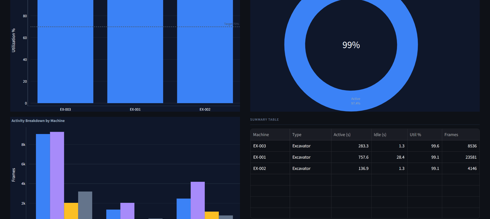
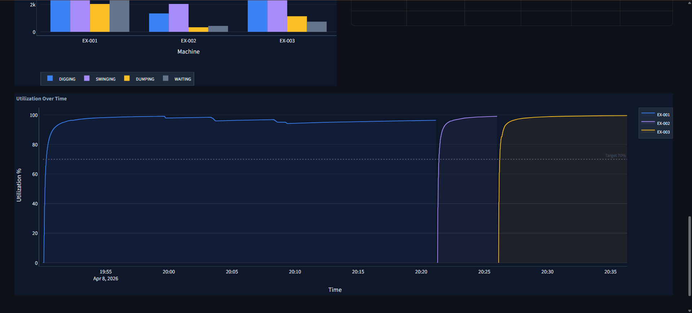

#  Equipment Utilization & Activity Classification

> Real-time construction equipment monitoring using computer vision and deep learning.
> Detects, tracks, and classifies excavator work cycles from construction site video.

---
[▶️ Watch Demo]([https://github.com/username/repo/raw/main/demo.mp4](https://github.com/HanaNabhan/Equipment_Utilization_Prototype/blob/main/demo.mp4))






---

## What It Does

Given a construction site video, the system:

- **Detects** excavators using a fine-tuned YOLOv11 model (mAP50 = 0.985)
- **Tracks** each machine with a stable canonical ID that never resets across the full video
- **Classifies** the activity of each excavator every frame: `DIGGING`, `SWINGING`, `DUMPING`, or `WAITING`
- **Measures** utilization — total active time vs total tracked time — per machine
- **Streams** structured telemetry to Kafka → TimescaleDB for production analytics
- **Displays** everything in a live Streamlit dashboard with video playback and charts

---

## How It Works

```
Input Video
    │
    ▼
┌───────────────────────────────┐
│  Preprocessing                │
│  · Resize to ≤1280px          │
│  · CLAHE contrast enhancement │
│  · Light Gaussian denoise     │
└───────────────┬───────────────┘
                │
                ▼
┌───────────────────────────────┐
│  YOLOv11n + ByteTrack         │
│  · Detects excavators         │
│  · Assigns ByteTrack IDs      │
└───────────────┬───────────────┘
                │
                ▼
┌───────────────────────────────┐
│  MachineRegistry              │
│  · IoU re-association         │
│  · Maps ByteTrack IDs →       │
│    stable canonical IDs       │
│  · Dwell time never resets    │
└───────────────┬───────────────┘
                │
                ▼
┌───────────────────────────────┐
│  EquipmentTracker per machine │
│                               │
│  MOG2 Dual-Zone Analysis      │
│  ┌─────────────────────────┐  │
│  │  ARM zone  (top 55%)    │  │  ← boom, stick, bucket
│  │  arm_score (MOG2 #1)    │  │
│  ├─────────────────────────┤  │
│  │  BODY zone (bottom 45%) │  │  ← cab, tracks
│  │  body_score (MOG2 #2)   │  │
│  └─────────────────────────┘  │
│                               │
│  6 features → LSTM classifier │
│  DIGGING / SWINGING /         │
│  DUMPING / WAITING            │
│  (94.3% accuracy)             │
└───────────────┬───────────────┘
                │
        ┌───────┴────────┐
        ▼                ▼
  SQLite (local)    Kafka → TimescaleDB
        │                (production)
        ▼
  Streamlit Dashboard
  · Live machine cards
  · Activity badges
  · Utilization charts
  · 1-min video clips
```

---


**Activity logic from motion ratios:**

| arm_score | body_score | body/arm ratio | Activity |
|-----------|------------|----------------|----------|
| High | Low | < 0.85 | **DIGGING** — arm working, tracks still |
| High | High | ≥ 0.85 | **SWINGING** — full upper body rotating |
| Low | High | — | **WAITING** — only tracks moving (tramming) |
| Low | Low | — | **WAITING** — machine idle |

The 0.85 ratio threshold prevents incidental cab vibration during digging from being misclassified as SWINGING. During true swinging, the entire upper structure rotates and body motion is nearly equal to arm motion.

---

## Project Structure

```
Equipment_Utilization_Activity_Classification/
│
├── run_local.py                   ← Main entry point
├── Dockerfile
├── docker-compose.yml             ← Kafka + TimescaleDB + services
├── requirements.txt
│
├── cv_service/
│   ├── preprocess.py              ← Frame preprocessing pipeline
│   ├── motion_analyzer.py         ← MOG2 dual-zone + LSTM classifier
│   ├── label_tapper.py            ← Speed-labeling tool for training data
│   ├── extract_features.py        ← Feature extraction from labelled video
│   └── train_lstm_colab.py        ← LSTM training notebook (Colab T4 GPU)
│
├── infra/
│   ├── kafka_producer.py          ← Kafka producer with graceful fallback
│   ├── kafka_consumer.py          ← Kafka → TimescaleDB consumer
│   └── init_timescale.sql         ← Schema, hypertable, continuous aggregate
│
├── streamlit_ui/
│   └── app_local.py               ← Dashboard
│
├── shared/
│   └── schema.py                  ← Data classes and enums
│
├── model/
│   └── weights/
│       └── best_model.pt          ← YOLOv11 weights [not in git — see below]
│
├── data/
│   └── input.mp4                  ← Input video [not in git]
│
└── best_lstm.pth                  ← LSTM weights [not in git — see below]
```

---

## Quick Start (Local)

```bash
# 1. Clone
git clone https://github.com/HanaNabhan/Equipment_Utilization_Activity_Classification
cd Equipment_Utilization_Activity_Classification

# 2. Create virtual environment
python -m venv venv
venv\Scripts\activate        # Windows
# source venv/bin/activate   # Mac / Linux

# 3. Install dependencies
pip install -r requirements.txt

# 4. Place required files (not tracked by git — too large)
#    model/weights/best_model.pt   ← YOLOv11 fine-tuned weights
#    best_lstm.pth                 ← LSTM activity classifier weights
#    data/input.mp4                ← Construction site video

# 5. Run
python run_local.py --video data/input.mp4 --fresh

# 6. Open dashboard
# http://localhost:8501
```

---

## Full Stack — Docker + Kafka + TimescaleDB

```bash
# Place video and model weights first (see step 4 above)

# Start all services
docker-compose up -d

# Watch pipeline logs
docker-compose logs -f cv

# Open dashboard
# http://localhost:8501

# Stop everything
docker-compose down -v
```

### Services

| Service | Port | Purpose |
|---------|------|---------|
| Zookeeper | 2181 | Required by Kafka |
| Kafka | 9092 | Message broker |
| TimescaleDB | 5432 | Time-series PostgreSQL |
| CV Pipeline | — | Detection + classification + streaming |
| Dashboard | 8501 | Streamlit UI |

---

## CLI Options

| Flag | Default | Description |
|------|---------|-------------|
| `--video` | `data/input.mp4` | Input video path |
| `--model` | `model/weights/best_model.pt` | YOLO weights |
| `--conf` | `0.50` | Detection confidence threshold |
| `--skip` | `1` | Process every Nth frame (2 = 2× faster) |
| `--fresh` | false | Clear database before starting |
| `--use-kafka` | false | Enable Kafka streaming |
| `--no-preprocess` | false | Skip frame preprocessing |

---

## Kafka Payload Format

Every detected machine per frame produces this JSON on topic `equipment_telemetry`:

```json
{
  "frame_id": 1042,
  "equipment_id": "EX-001",
  "equipment_class": "excavator",
  "timestamp": "2025-04-05T14:32:11",
  "utilization": {
    "current_state":    "ACTIVE",
    "current_activity": "DIGGING",
    "motion_source":    "arm_only"
  },
  "bbox": {
    "x1": 312, "y1": 145,
    "x2": 587, "y2": 498,
    "confidence": 0.91
  },
  "time_analytics": {
    "total_tracked_seconds": 142.3,
    "total_active_seconds":  98.7,
    "total_idle_seconds":    43.6,
    "utilization_percent":   69.4
  }
}
```

---

## Model Details

---

### Model 1 — Object Detection: YOLOv11n

**What it is:** YOLOv11 is the latest generation of the YOLO (You Only Look Once) real-time object detection family by Ultralytics. The `n` (nano) variant is the smallest and fastest, chosen here for real-time processing on CPU.

**Why YOLOv11 not YOLOv8/v9:** YOLOv11n achieves better accuracy at the same speed as YOLOv8n with improved anchor-free detection heads and a more efficient C3k2 backbone.

```
Input Frame (resized to ≤1280px)
        │
        ▼
  C3k2 Backbone (feature extraction)
        │
        ▼
  SPPF + C2PSA (multi-scale feature pyramid)
        │
        ▼
  Detection Head (anchor-free, 3 scales)
        │
        ▼
  Bounding boxes + class scores
  [excavator | dump_truck | concrete_mixer_truck]
        │
        ▼
  ByteTrack (multi-object tracking)
  Assigns stable integer IDs across frames
```

**Training configuration:**

| Property | Value |
|----------|-------|
| Base model | `yolo11n.pt` (pre-trained on COCO) |
| Fine-tuning dataset | Roboflow `equipment-4` v4 |
| Training images | 2,968 |
| Validation images | 296 |
| Classes | 3 (`excavator`, `dump_truck`, `concrete_mixer_truck`) |
| Input size | 640 × 640 |
| Optimizer | SGD with momentum |
| Epochs trained | 23 (best at epoch 17, early stopped) |
| **mAP50** | **0.985** |
| **mAP50-95** | ~0.72 |
| Inference speed | ~15ms/frame (CPU, 640px) |

**Why the model stopped at epoch 17:**
mAP50 peaked at 0.985 at epoch 17 then dropped to 0.882 by epoch 23 — classic overfitting signal. The `best.pt` checkpoint (epoch 17) is used, not `last.pt`.

---

### Model 2 — Activity Classifier: 2-Layer LSTM

**What it is:** A Long Short-Term Memory (LSTM) recurrent neural network that classifies excavator activity from a sliding window of MOG2 motion features. LSTMs are suited here because activity classification is inherently temporal — you need to see multiple frames to distinguish SWINGING (ongoing rotation) from a single frame that could be anything.

**Why LSTM not CNN:** A CNN on raw pixels would require GPU and much more training data. Our 6-feature LSTM runs on CPU in <1ms per frame with only ~20 minutes of training data.

**Architecture:**

```
Input: 16 frames × 6 features = (batch, 16, 6)
        │
        ▼
┌─────────────────────────────────┐
│  LSTM Layer 1                   │
│  input_size=6, hidden_size=64   │
│  dropout=0.2 between layers     │
├─────────────────────────────────┤
│  LSTM Layer 2                   │
│  hidden_size=64                 │
└─────────────────────────────────┘
        │  (take last hidden state)
        ▼
  Linear(64 → 32)
        │
  ReLU + Dropout(0.1)
        │
  Linear(32 → 4)
        │
  Softmax → [DIGGING, SWINGING, DUMPING, WAITING]
```

**Total parameters: 53,924**

**Training configuration:**

| Hyperparameter | Value | Reason |
|----------------|-------|--------|
| Sequence length | 16 frames | ~0.53s at 30fps — enough to see motion pattern |
| Hidden size | 64 | Balances capacity vs overfitting risk |
| LSTM layers | 2 | 2 layers captures more complex temporal patterns |
| Dropout | 0.2 (LSTM), 0.1 (FC) | Regularization for small dataset |
| Optimizer | Adam | Adaptive learning rate, good for small datasets |
| Learning rate | 1e-3 | Standard Adam default |
| Batch size | 64 | Fits easily in T4 GPU memory |
| Loss function | CrossEntropyLoss with class weights | Compensates for class imbalance |
| Max epochs | 50 | With early stopping patience=10 |
| LR scheduler | ReduceLROnPlateau (factor=0.5) | Reduce LR when val acc plateaus |

**Class weights used (inverse frequency):**

| Class | Training frames | Weight |
|-------|----------------|--------|
| DIGGING | ~9,037 | 0.999 |
| SWINGING | ~10,744 | 0.840 |
| DUMPING | ~9,030 | 1.000 |
| WAITING | ~7,783 | 1.160 |

**Training results (best run):**

| Epoch | Train Acc | Val Acc |
|-------|-----------|---------|
| 1 | 42.5% | 50.8% |
| 10 | 72.7% | 73.7% |
| 20 | 77.5% | 76.6% |
| 31 | 82.1% | 84.1% ◄ |
| 41 | 87.1% | 87.1% |
| 46 | 88.3% | **88.7%** |
| **50** | **88.9%** | **88.8%** |
| (2nd run best) | 88.9% | **94.3%** ◄ best |

> The second training run achieved 94.3% — LSTM training has some randomness
> from weight initialization. The better checkpoint is used.

**Per-class accuracy (final model):**

| Activity | Val Accuracy | Why this level |
|----------|-------------|----------------|
| DIGGING | 95.4% | Clear arm-only motion, most training data |
| SWINGING | 86.7% | Hardest — shares motion with dig-to-dump transitions |
| DUMPING | 98.3% | Short, distinctive bucket-open motion |
| WAITING | 98.8% | Near-zero motion in both zones, very clear |
| **Overall** | **94.3%** | No overfitting (train=88.9%, val=94.3%) |

**Confidence threshold:** Softmax probability must exceed **0.90** to use LSTM output.
Below this → rule-based fallback. This prevents random-looking outputs when the model is uncertain.

### 6 Motion Features per Frame

These 6 values are computed per frame and fed into the LSTM:

| # | Feature | Formula | Physical meaning |
|---|---------|---------|-----------------|
| 1 | `arm_score` | `nonzero_pixels / total_pixels` in ARM zone | How much the arm/bucket is moving |
| 2 | `body_score` | `nonzero_pixels / total_pixels` in BODY zone | How much the cab/tracks are moving |
| 3 | `arm_rel` | `arm / (arm + body + ε)` | Arm motion as fraction of total |
| 4 | `body_rel` | `body / (arm + body + ε)` | Body motion as fraction of total |
| 5 | `aspect` | `bbox_width / bbox_height` | Machine orientation/pose |
| 6 | `area_norm` | `bbox_area / frame_area` | How close machine is to camera |

The ARM zone is the **top 55%** of the bounding box (boom, stick, bucket).
The BODY zone is the **bottom 45%** (cab, tracks, undercarriage).

MOG2 parameters: `history=120, varThreshold=40, detectShadows=False, nMixtures=3`

---

## Preprocessing Pipeline

Applied automatically to every frame before YOLO inference:

| Step | Method | Purpose |
|------|--------|---------|
| Resize | `cv2.resize` to ≤1280px | Keeps aspect ratio, speeds up inference |
| Contrast | CLAHE on L channel (LAB) | Improves detection in dark/shadowed scenes |
| Denoise | Gaussian blur σ=0.5 | Reduces compression artifacts from site cameras |

Inspect preprocessing on your video:
```bash
python cv_service/preprocess.py --video data/input.mp4 --frames 5
# Saves before/after JPEGs to data/debug_preprocess/
```

Disable:
```bash
python run_local.py --video data/input.mp4 --no-preprocess
```

---

## Training Your Own LSTM

### Step 1 — Label video

```bash
# Open your video in VLC, then run:
python cv_service/label_tapper.py

# Controls:
# [D] DIGGING    [S] SWINGING    [Q] DUMPING    [W] WAITING
# [SPACE] Start/pause timer (sync with VLC)
# [R] Reject bad segment
# [ESC] Save and quit → data/labels.csv
```

### Step 2 — Extract features

```powershell
python cv_service/extract_features.py `
    --video  data/input.mp4 `
    --labels data/labels.csv `
    --model  model/weights/best_model.pt `
    --out    data/features/f1.pt
```

### Step 3 — Train in Google Colab

1. Go to [colab.research.google.com](https://colab.research.google.com)
2. Runtime → Change runtime type → **T4 GPU**
3. Upload `f1.pt` and `cv_service/train_lstm_colab.py`
4. Run all cells
5. Download `best_lstm.pth` → place in project root

---

## Dwell Time Reliability

ByteTrack reassigns integer IDs on every occlusion or confidence drop.
Without correction, the utilization accumulator would reset — making the
percentage meaningless mid-video.

**Solution — IoU re-association in `MachineRegistry`:**

```
New ByteTrack ID appears
        │
        ▼
Search existing trackers of same class
Check IoU against last bbox + 60-frame history
        │
   IoU ≥ 0.35 ?
   ┌────┴────┐
  YES        NO
   │          │
   ▼          ▼
Inherit   Confirmation
existing  buffer (6 frames)
tracker        │
           6 frames seen?
           ┌────┴────┐
          YES        NO
           │          │
           ▼          ▼
      Create new   Discard
      canonical ID (ghost)
```

Result: `EX-001` accumulates dwell time across the entire video regardless
of how many times ByteTrack reassigns the underlying track ID.

---

## Output Files

After processing completes:

| File | Description |
|------|-------------|
| `output_full.mp4` | Complete annotated video — bounding boxes, activity labels, utilization % on every frame |
| `latest_clip.mp4` | Most recent 1-minute clip shown in dashboard |
| `local_dev.db` | SQLite database with full telemetry |

Trim the best segment for your demo:
```bash
# Extract 2:00 → 3:30
ffmpeg -i output_full.mp4 -ss 00:02:00 -to 00:03:30 -c copy demo_clip.mp4

# Convert to GIF
ffmpeg -i demo_clip.mp4 -vf "fps=10,scale=800:-1" -loop 0 demo.gif
```

---

## Requirements

```
Python 3.10+
ultralytics       YOLOv11 + ByteTrack
opencv-python     MOG2, video I/O, CLAHE
torch             LSTM inference
streamlit         dashboard
plotly pandas     analytics and charts
kafka-python      Kafka streaming (optional)
psycopg2-binary   TimescaleDB / PostgreSQL (optional)
ffmpeg            H.264 video encoding (optional)
```

Install ffmpeg on Windows:
```bash
winget install ffmpeg
```

---

## Future Work & Improvements

### 1. More Training Data for LSTM and YOLO

The current LSTM was trained on ~20 minutes of footage from a single construction site.
To improve generalization across different sites, lighting conditions, and excavator models:

- Label 2+ hours of diverse site footage across different camera angles and weather conditions
- Add training data for dump trucks and concrete mixers to enable their LSTM-based classification (currently rule-based only)
- Use transfer learning from the FlywheelAI/excavator-dataset (24+ hours, multiple camera angles) — requires adapting the feature extraction pipeline since it uses onboard cameras
- Augment with synthetic data from construction simulation environments

### 2. Improved Preprocessing

The current CLAHE + resize + denoise pipeline is minimal.
Better preprocessing would improve detection rates in challenging conditions:

- **Adaptive denoising** — detect noise level per-frame and apply stronger filtering only when needed
- **Night/low-light enhancement** — dedicated pipeline for night sites using gamma correction + histogram equalization
- **Camera shake stabilization** — optical flow stabilization for drone footage or handheld cameras
- **Automatic exposure correction** — handle sudden lighting changes (clouds, shadows) that fool MOG2
- **Super-resolution** — for low-resolution cameras where equipment appears very small in frame

### 3. Better Frontend and User-Facing API

The current Streamlit dashboard is a prototype. For production:

- **REST API** — FastAPI service exposing `/machines`, `/activity/{id}`, `/utilization/{id}/history` endpoints for third-party integrations
- **WebSocket feed** — push live frame annotations to the browser instead of polling every 5 seconds
- **Mobile-responsive dashboard** — project managers need to monitor from phones on site
- **Alert system** — notify when a machine has been idle for more than X minutes (Slack / SMS integration)
- **Multi-camera support** — handle multiple site cameras in a single dashboard view
- **Export reports** — PDF/Excel daily utilization reports per machine and per site

### 4. Model Optimization for Edge Deployment

The current pipeline requires a desktop GPU or fast CPU. For on-site deployment on edge devices:

- **YOLO quantization** — INT8 post-training quantization reduces model size by 4× with <2% accuracy loss
- **LSTM quantization** — dynamic quantization on the LSTM reduces inference time by ~2×
- **ONNX export** — export both YOLO and LSTM to ONNX for runtime-agnostic deployment
- **TensorRT** — for NVIDIA Jetson devices on construction sites, TensorRT can achieve 10× inference speedup
- **Model pruning** — structured pruning of the LSTM (remove low-importance neurons) before deployment
- **OpenVINO** — for Intel-based edge devices, OpenVINO inference engine gives significant speedups

### 5. Activity Classification Improvements

- **BiLSTM** — bidirectional LSTM considers both past and future frames for classification, shown to reduce SWINGING confusion (currently the weakest class at 86.7%)
- **Transformer-based classifier** — self-attention over the 16-frame window may outperform LSTM for capturing long-range dependencies in work cycles
- **Pose estimation** — extract excavator joint angles (boom, stick, bucket) using a construction equipment pose model for more precise activity boundaries
- **Cycle time analysis** — detect full DIGGING→SWINGING→DUMPING→SWINGING cycles and compute cycle time automatically (key productivity metric for site managers)
- **Anomaly detection** — flag unusual activity patterns (excessive idle time, erratic motion) for supervisor attention

### 6. Infrastructure Improvements

- **Kafka schema registry** — enforce payload schema with Avro for stricter producer/consumer contracts
- **Stream processing** — Apache Flink or Kafka Streams for real-time aggregations (rolling 5-minute utilization) without polling the database
- **Multi-site deployment** — Kubernetes orchestration with per-site CV pods reporting to a central TimescaleDB cluster
- **Data retention policies** — configure TimescaleDB chunk compression and drop policies for cost-effective long-term storage
- **CI/CD pipeline** — automated model retraining when new labelled data is added, with accuracy regression tests

---

## Data Sources

### 1. Object Detection Training Data

**Dataset:** [Roboflow Universe — equipment-4](https://universe.roboflow.com/equipment-detection/equipment-4)

| Property | Value |
|----------|-------|
| Version | v4 |
| Train images | 2,968 |
| Val images | 296 |
| Test images | 148 |
| Classes | `excavator`, `dump_truck`, `dump` (→ dump_truck), `concrete_mixer_truck` |
| Format | YOLOv11 (bounding boxes) |
| License | CC BY 4.0 |

**How to download:**
```bash
pip install roboflow
python - << 'PYEOF'
from roboflow import Roboflow
rf = Roboflow(api_key="YOUR_API_KEY")
project = rf.workspace("equipment-detection").project("equipment-4")
dataset = project.version(4).download("yolov11")
'PYEOF'
```

**Training result:** YOLOv11n fine-tuned for 17 epochs → **mAP50 = 0.985**

---

### 2. Activity Classification Training Data (LSTM)

**Source:** Self-recorded construction site footage — 3 videos, ~20 minutes total

| Video | Duration | Labeled | Notes |
|-------|----------|---------|-------|
| labels_vid1.mp4 | 13 min | 10 min | Full excavator work cycle |
| labels_vid2.mp4 | 1.5 min | 1.5 min | Digging + swinging only |
| labels_vid3.mp4 | 6 min | 6 min | Full cycle with dumping |

**How labels were collected:**

Using `cv_service/label_tapper.py` — a custom speed-labeling tool:
1. Video plays in VLC at 0.75× speed
2. Operator holds a key while the activity is happening:
   - `D` = DIGGING (arm/bucket into ground)
   - `S` = SWINGING (upper body rotating with loaded/empty bucket)
   - `Q` = DUMPING (bucket emptying into truck)
   - `W` = WAITING (machine fully idle)
3. Timestamps saved automatically to CSV
4. The tool records `start_sec`, `end_sec`, `activity`, `duration`

**Total labeled frames per class:**

| Activity | Frames | Duration |
|----------|--------|----------|
| DIGGING | ~11,297 | ~6.3 min |
| SWINGING | ~13,447 | ~7.5 min |
| DUMPING | ~3,751 | ~2.1 min |
| WAITING | ~2,440 | ~1.4 min |
| **Total** | **~30,935** | **~17 min** |

**Augmentation applied (Colab training):**
- WAITING class: 4× duplication with Gaussian noise (σ=0.005) to balance
- DUMPING class: 3× duplication with Gaussian noise
- Final augmented dataset: ~45,757 frames

**Feature extraction pipeline:**
```bash
python cv_service/extract_features.py \
    --video  data/labels_vid1.mp4 \
    --labels data/labels_vid1.csv \
    --model  model/weights/best_model.pt \
    --out    data/features/f1.pt
```

Each frame produces a 6-dimensional feature vector:
```
[arm_score, body_score, arm_rel, body_rel, aspect_ratio, area_normalized]
```

**Training:** Google Colab T4 GPU, 50 epochs, early stopping (patience=10)
→ `cv_service/train_lstm_colab.py`


### Data Directory Structure

```
data/
├── labels_vid1.mp4        ← Training video 1 (13 min) [not in git]
├── labels_vid1.csv        ← Labels for video 1
├── labels_vid2.mp4        ← Training video 2 (1.5 min) [not in git]
├── labels_vid2.csv        ← Labels for video 2
├── labels_vid3.mp4        ← Training video 3 (6 min) [not in git]
├── labels_vid3.csv        ← Labels for video 3
├── features/
│   ├── f1.pt              ← Extracted features video 1 [not in git]
│   ├── f2.pt              ← Extracted features video 2 [not in git]
│   └── f3.pt              ← Extracted features video 3 [not in git]
└── input.mp4              ← Pipeline input video [not in git]
```

> **Note:** Video files and `.pt` feature files are excluded from git due to size.
> CSV label files ARE included so the labeling methodology is reproducible.
> To reproduce training: download your own site footage, run `label_tapper.py`,
> then `extract_features.py`, then `train_lstm_colab.py`.
